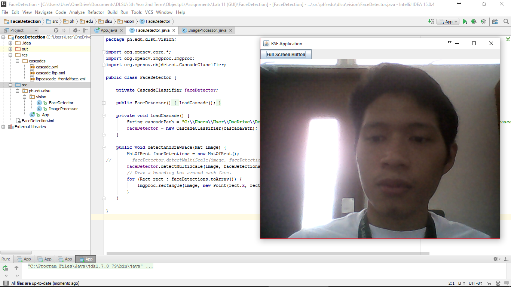

#FaceDetection

Trying to detect faces.

#ScreenShot

#Codes

###App
~~~
package ph.edu.dlsu;

import org.opencv.core.Core;
import org.opencv.core.Mat;
import org.opencv.videoio.VideoCapture;
import org.opencv.videoio.Videoio;
import ph.edu.dlsu.vision.FaceDetector;
import ph.edu.dlsu.vision.ImageProcessor;

import javax.swing.*;
import java.awt.*;
import java.awt.event.ActionEvent;
import java.awt.event.ActionListener;

public class App {

    static {
        System.loadLibrary(Core.NATIVE_LIBRARY_NAME);
    }

    static class AppFrame extends JFrame {
        private static final GraphicsDevice videoCard = (GraphicsEnvironment.getLocalGraphicsEnvironment().getScreenDevices())[0];
        private static final boolean FULLSCREEN_SUPPORTED = videoCard.isFullScreenSupported();

        private static final String MAKE_FULLSCREEN_TEXT = "Full Screen Button";
        private static final String MAKE_WINDOWED_TEXT = "Exit Full Screen";

        // Main Menu Window
        private static final int WINDOWED_WIDTH = 640;
        private static final int WINDOWED_HEIGHT = 480;

        // Fullscreen Button
        private final JButton fsButton = new JButton(MAKE_FULLSCREEN_TEXT);
        private JLabel imageLabel;
        private boolean isFullscreen = false;

        public AppFrame(String title) {
            super(title);
            setSize(WINDOWED_WIDTH, WINDOWED_HEIGHT);
            setDefaultCloseOperation(JFrame.EXIT_ON_CLOSE);
            initComponents();
        }

        public void initComponents() {
            setLayout(new BoxLayout(getContentPane(), BoxLayout.Y_AXIS));
            if (FULLSCREEN_SUPPORTED) {
                fsButton.addActionListener(new ActionListener() {
                    @Override
                    public void actionPerformed(ActionEvent e) {
                        toggleFullscreen();
                    }
                });
                add(fsButton);
            } else {
                add(new JLabel("Fullscreen mode is not supported on this device."));
            }

            // Add
            imageLabel = new JLabel();
            add(imageLabel);
        }

        public void toggleFullscreen() {
            isFullscreen = !isFullscreen;
            setVisible(false);
            dispose();
            setUndecorated(isFullscreen);
            if (isFullscreen) {
                fsButton.setText(MAKE_WINDOWED_TEXT);
                videoCard.setFullScreenWindow(this);
                validate();
            } else {
                fsButton.setText(MAKE_FULLSCREEN_TEXT);
                videoCard.setFullScreenWindow(null);
                setVisible(true);
            }
        }
    }

    static class GUI {

        private AppFrame appFrame;
        private FaceDetector faceDetector;

        public GUI(String title) {
            appFrame = new AppFrame(title);
            faceDetector = new FaceDetector();
        }

        public void start() {
            SwingUtilities.invokeLater(new Runnable() {
                public void run() {
                    getAppFrame().setVisible(true);
                }
            });
        }

        public AppFrame getAppFrame() {
            return appFrame;
        }

        private void runMainLoop(String[] args) {
            ImageProcessor imageProcessor = new ImageProcessor();
            Mat webcamMatImage = new Mat();
            Image tempImage;
            VideoCapture capture = new VideoCapture(0);
            capture.set(Videoio.CAP_PROP_FRAME_WIDTH, 640);
            capture.set(Videoio.CAP_PROP_FRAME_HEIGHT, 480);
            if (capture.isOpened()) {
                while (true) {
                    capture.read(webcamMatImage);
                    if (!webcamMatImage.empty()) {
                        // DetectFace
                        faceDetector.detectAndDrawFace(webcamMatImage);
                        tempImage = imageProcessor.toBufferedImage(webcamMatImage);
                        ImageIcon imageIcon = new ImageIcon(tempImage, "Captured video");
                        appFrame.imageLabel.setIcon(imageIcon);
                        appFrame.pack(); //this will resize the window to fit the image
                    } else {
                        System.out.println(" -- Frame not captured -- Break!");
                        break;
                    }
                }
            } else {
                System.out.println("Couldn't open capture.");
            }
        }
    }

    public static void main(String[] args) {
        GUI gui = new GUI("BSE Application");
        gui.start();
        gui.runMainLoop(args);
    }

}
~~~

###FaceDetection
~~~
package ph.edu.dlsu.vision;

import org.opencv.core.*;
import org.opencv.imgproc.Imgproc;
import org.opencv.objdetect.CascadeClassifier;

public class FaceDetector {

    private CascadeClassifier faceDetector;

    public FaceDetector() {
        loadCascade();
    }

    private void loadCascade() {
        String cascadePath = "C:\\Users\\User\\OneDrive\\Documents\\DLSU\\5th Year 2nd Term\\ObjectpL\\Assignments\\Lab 11 (GUI)\\FaceDetection\\res\\cascades\\lbpcascade_frontalface.xml";
        faceDetector = new CascadeClassifier(cascadePath);
    }

    public void detectAndDrawFace(Mat image) {
        MatOfRect faceDetections = new MatOfRect();
//        faceDetector.detectMultiScale(image, faceDetections, 1.1, 7, 0, new Size(250, 40), new Size());
        faceDetector.detectMultiScale(image, faceDetections, 1.1, 7, 0, new Size(), new Size());
        // Draw a bounding box around each face.
        for (Rect rect : faceDetections.toArray()) {
            Imgproc.rectangle(image, new Point(rect.x, rect.y), new Point(rect.x + rect.width, rect.y + rect.height), new Scalar(0, 255, 0));
        }
    }

}
~~~

###ImageProcessor
~~~
package ph.edu.dlsu.vision;

import org.opencv.core.Mat;

import java.awt.image.BufferedImage;
import java.awt.image.DataBufferByte;

/**
 * Created by cobalt on 3/1/16.
 */
public class ImageProcessor {

    public BufferedImage toBufferedImage(Mat matrix){
        int type = BufferedImage.TYPE_BYTE_GRAY;
        if ( matrix.channels() > 1 ) {
            type = BufferedImage.TYPE_3BYTE_BGR;
        }
        int bufferSize = matrix.channels()*matrix.cols()*matrix.rows();
        byte [] buffer = new byte[bufferSize];
        matrix.get(0,0,buffer); // get all the pixels
        BufferedImage image = new BufferedImage(matrix.cols(),matrix.rows(), type);
        final byte[] targetPixels = ((DataBufferByte) image.getRaster().getDataBuffer()).getData();
        System.arraycopy(buffer, 0, targetPixels, 0, buffer.length);
        return image;
    }
}
~~~
